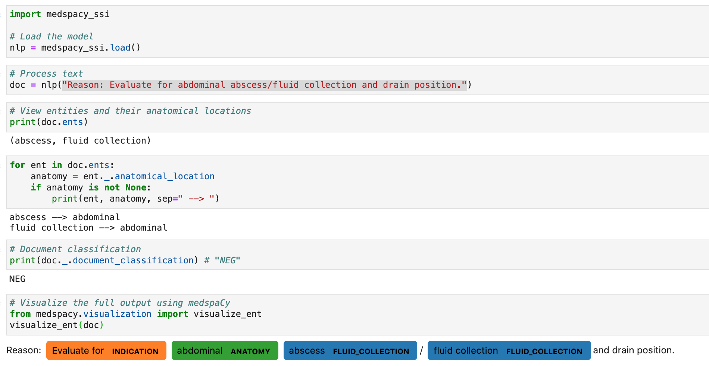

# medspacy-ssi
This Python package implements the model described in [Detecting Evidence of Intra-abdominal Surgical Site Infections from Radiology Reports Using Natural Language Processing](https://pubmed.ncbi.nlm.nih.gov/29854116/) 
as a medspaCy model, refactoring from a pyConTextNLP package. This model will extract mentions of fluid collections from 
the text, assert whether those clinical findings are present using ConText, link to anatomical locations, and create a document-level inference
of "POS" or "NEG".

This package requires `medspacy`. The package and dependencies can be installed by running in this folder:
```bash
python setup.py install
```

# Usage
A simple demo can be found in `./notebooks/Demo.ipynb`
```python
import medspacy_ssi

# Load the model
nlp = medspacy_ssi.load()

# Process text
doc = nlp("Reason: Evaluate for abdominal abscess/fluid collection and drain position.")

# View entities and their anatomical locations
print(doc.ents)

for ent in doc.ents:
    anatomy = ent._.anatomical_location
    if anatomy is not None:
        print(ent, anatomy, sep=" --> ")

# Document classification
print(doc._.document_classification) # "NEG"

# Visualize the full output using medspaCy
from medspacy.visualization import visualize_ent
visualize_ent(doc)
```

`Output:`
